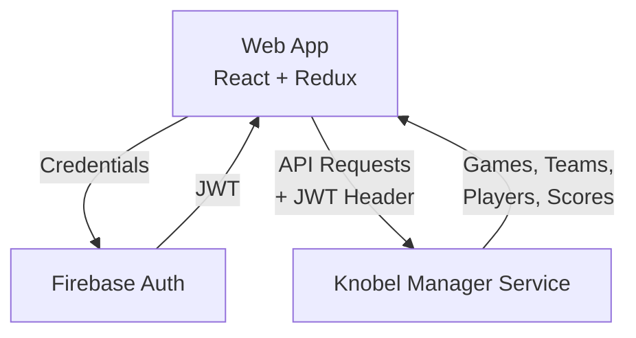

# Knobel Manager App

[](https://github.com/henok321/knobel-manager-app/actions/workflows/deploy.yml)

Tournament manager for the dice game "Knobeln" (aka "Schocken"). React 19 + TypeScript + Redux Toolkit + Mantine UI

**Backend service**: [knobel-manager-service](https://github.com/henok321/knobel-manager-service)

## Architecture



## Software Stack

- **React 19**: UI framework with modern hooks and concurrent features
- **TypeScript**: Type-safe JavaScript with strict mode enabled
- **Redux + Redux Toolkit**: State management with normalized entity adapters
- **Mantine UI v8**: Component library with built-in theming
- **Firebase v12**: Hosting and authentication with JWT tokens
- **Vite**: Build tool and dev server

## Setup

```bash
nvm install && nvm use
npm install
```

## Development

```bash
npm run local  # Dev server with local API (requires backend at localhost:8080)
npm run prod   # Dev server with production API
```

## Build & Deploy

```bash
npm run build   # Production build
npm run deploy  # Build + Firebase deploy
```

## Code Quality

```bash
npm run fix   # Auto-fix linting and formatting (runs on pre-commit)
npm run lint  # ESLint check
npm test      # Run tests
npm run knip  # Check for unused files/dependencies
```

## Maintenance

```bash
npx npm-check-updates -u -i  # Update dependencies interactively
npx npm-check-updates -u -i -t minor  # Update dependencies to latest minor version
npm ci             # Remove node_modules and dist
```

## License

This project is licensed under the MIT License - see the [LICENSE](LICENSE) file for details.
