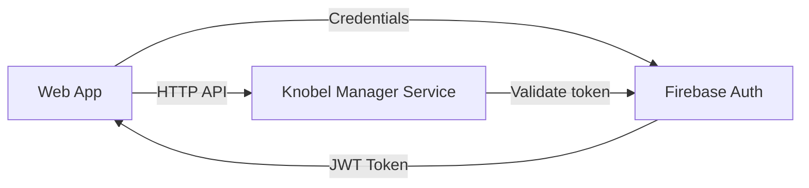

# Knobel Manager App

[](https://github.com/henok321/knobel-manager-app/actions/workflows/pipeline.yml)
[](https://github.com/henok321/knobel-manager-app/actions/workflows/github-code-scanning/codeql)
[](https://www.codefactor.io/repository/github/henok321/knobel-manager-app)

Tournament manager for the dice game "Knobeln" (aka "Schocken"). React 19 + TypeScript + Redux Toolkit + Mantine UI

**Backend service**: [knobel-manager-service](https://github.com/henok321/knobel-manager-service)

## Architecture



## Software Stack

- **React 19**: UI framework with modern hooks and concurrent features
- **TypeScript**: Type-safe JavaScript with strict mode enabled
- **Redux + Redux Toolkit**: State management with normalized entity adapters
- **Mantine UI v8**: Component library with built-in theming
- **Firebase v12**: Hosting and authentication with JWT tokens
- **Vite**: Build tool and dev server

## Setup

```bash
nvm install && nvm use
corepack enable
pnpm install
```

## Development

```bash
pnpm local  # Dev server with local API (requires backend at localhost:8080)
pnpm prod   # Dev server with production API
```

## Build & Deploy

```bash
pnpm build   # Production build
pnpm deploy  # Build + Firebase deploy
```

## Code Quality

```bash
pnpm fix   # Auto-fix linting and formatting (runs on pre-commit)
pnpm lint  # ESLint check
pnpm test  # Run tests
pnpm knip  # Check for unused files/dependencies
```

## Maintenance

```bash
pnpm up -i                          # Update dependencies interactively
pnpm dlx npm-check-updates -u -i   # Alternative updater
pnpm clean                          # Remove node_modules and dist
```

## License

This project is licensed under the MIT License - see the [LICENSE](LICENSE) file for details.
