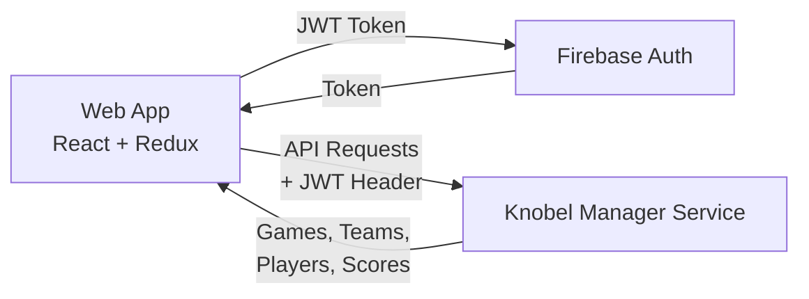

# Knobel Manager App

[](https://github.com/henok321/knobel-manager-app/actions/workflows/deploy.yml)

Tournament manager for the dice game "Knobeln" (aka "Schocken"). React 19 + TypeScript + Redux Toolkit + Mantine UI

**Backend service**: [knobel-manager-service](https://github.com/henok321/knobel-manager-service)

## Architecture



## Setup

```bash
nvm install && nvm use
corepack enable
yarn install
```

## Development

```bash
yarn local  # Dev server with local API (requires backend at localhost:8080)
yarn prod   # Dev server with production API
```

## Build & Deploy

```bash
yarn build   # Production build
yarn deploy  # Build + Firebase deploy
```

## Code Quality

```bash
yarn fix   # Auto-fix linting and formatting (runs on pre-commit)
yarn lint  # ESLint check
yarn test  # Run tests
yarn knip  # Check for unused files/dependencies
```

## Maintenance

```bash
yarn up -i     # Update dependencies interactively
yarn clean     # Remove node_modules and dist
```

## License

This project is licensed under the MIT License - see the [LICENSE](LICENSE) file for details.
